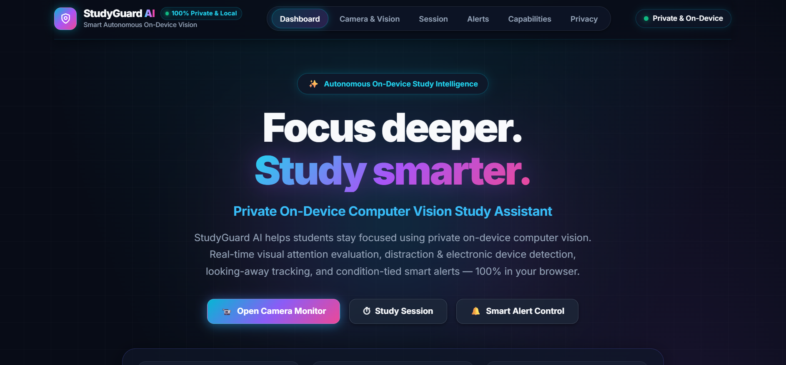
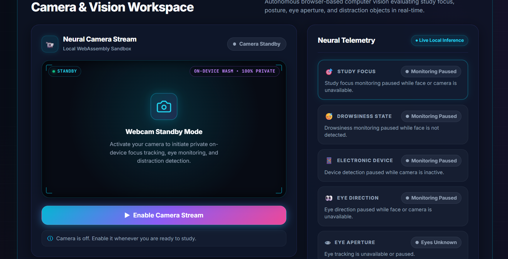
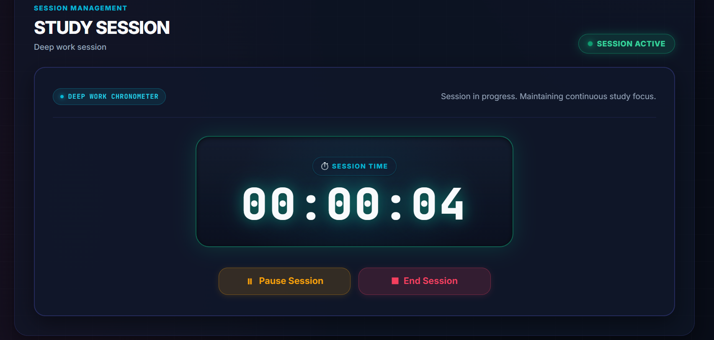
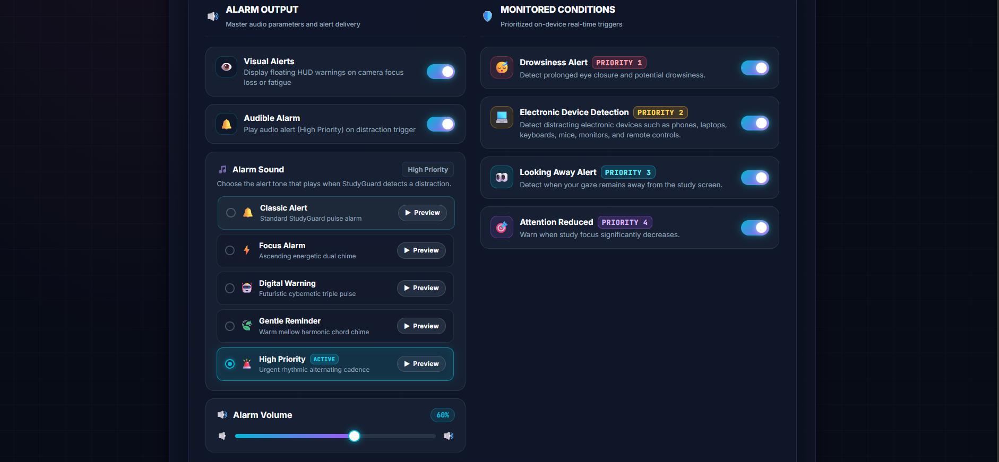
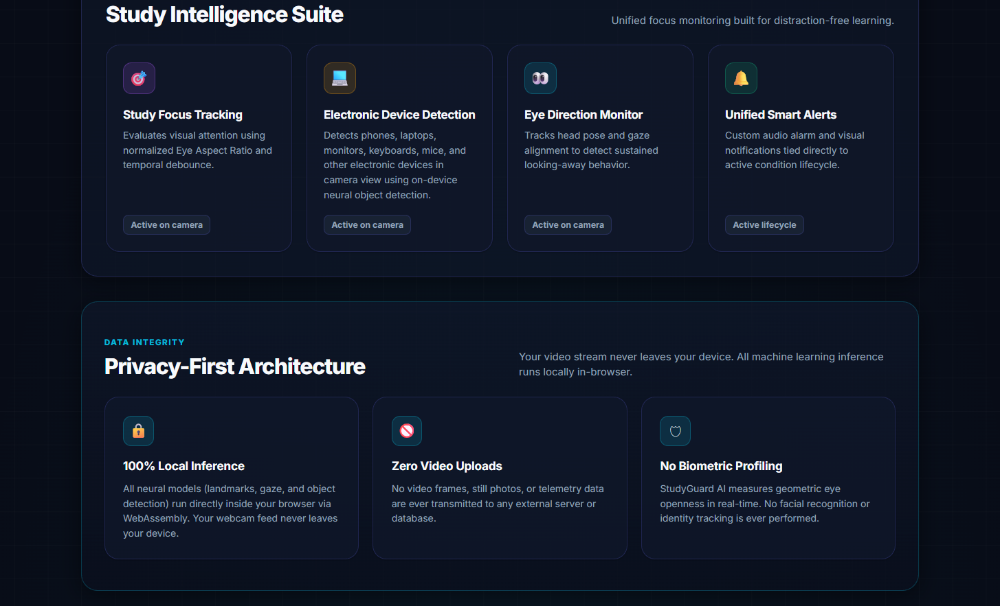

# 🧠 StudyGuard AI

### Autonomous Private On-Device Study Intelligence

[](https://study-guard-ai-topaz.vercel.app)
[](https://react.dev)
[](https://vitejs.dev)
[](https://developers.google.com/mediapipe)
[](https://study-guard-ai-topaz.vercel.app)
[](https://opensource.org/licenses/MIT)

---

## 📌 Project Introduction

**StudyGuard AI** is a privacy-first, browser-based computer vision study assistant engineered to help students, developers, and researchers maintain uninterrupted focus during deep work sessions.

Unlike conventional proctoring or focus-tracking solutions that transmit raw video feeds to remote cloud servers, StudyGuard AI executes state-of-the-art neural vision models **100% locally inside the user's browser sandbox** using Google MediaPipe, WebAssembly (WASM), and WebGL hardware acceleration. 

The application operates completely on-device without requiring end users to run a local backend, install specialized drivers, or expose their personal study space to third-party cloud infrastructure.

---

## 🚀 Live Demo

Experience StudyGuard AI directly in your browser:

🌐 **[Launch StudyGuard AI (Production App)](https://study-guard-ai-topaz.vercel.app)**  
*(Alternative Domain Alias: [study-guard-ai-vimleshyadav.vercel.app](https://study-guard-ai-vimleshyadav.vercel.app))*

> **No installation or account creation required.** Works out-of-the-box on modern desktop browsers (Chrome, Edge, Brave, Firefox).

---

## ✨ Key Features

### 🎯 Real-Time Study Focus Monitoring
StudyGuard AI continuously evaluates visual attention and study engagement in real time.
- Continuous facial presence verification and focus tracking
- Distinguishes active study from study-space desertion
- Real-time attention reduction detection
- Temporal debounce smoothing to eliminate false positives during natural micro-movements

### 📱 Electronic Device Detection
The system detects distracting electronic devices visible in the camera stream.
- Identifies mobile phones, laptops, monitors, keyboards, mice, and remote controls
- High-speed 130ms inference loop (~7.5 FPS) optimized for rapid phone detection
- Normalized category resolution (`cell phone`, `phone`, `mobile phone`, `telephone`)
- Fast 2-hit temporal confirmation (~160ms) for high-confidence detections
- Dynamic bounding box rendering on the live video canvas

### 👀 Eye and Gaze Monitoring
StudyGuard AI analyzes eye behavior and visual attention in real time.
- Eye aperture monitoring via normalized geometric metrics
- 3D head yaw and gaze vector tracking using a 468-point facial mesh
- Detection of sustained looking-away behavior ($\ge 1.5\text{s}$)
- Head pose orientation awareness to re-center attention

### 😴 Drowsiness Detection
Continuous fatigue evaluation through eye aspect geometry.
- Real-time calculation of normalized Eye Aspect Ratio (EAR) across both eyes
- Multi-stage state machine that distinguishes involuntary natural blinking from fatigue-induced microsleeps
- Autonomous trigger for prolonged eyelid closures ($\ge 2.0\text{s}$) with automated clearance upon eye reopening

### 🚨 Unified Smart Alert System
Autonomous, prioritized alert resolution matrix preventing notification overload.
- Four-tier severity arbitration: **P1: Drowsiness** $\rightarrow$ **P2: Electronic Device** $\rightarrow$ **P3: Looking Away** $\rightarrow$ **P4: Attention Loss**
- Color-coded visual HUD banners with instant dismiss
- Quick-mute toggle and condition-based lifecycle management

### 🔊 Custom Alarm System
Integrated dual-engine audio alert system with 5 selectable alarm styles.
- **Classic Alert** — Balanced acoustic chime
- **Focus Alarm** — Rhythmic focus pulse
- **Digital Warning** — Cybernetic digital radar
- **Gentle Reminder** — Soft ambient chime
- **High Priority** — High-acuity rapid alert
- Live audio preview, adjustable volume slider, and persistent `localStorage` preference saving
- Automatic Web Audio API procedural synthesizer fallback if browser autoplay policies restrict media playback

### ⏱️ Study Session Management
Built-in deep work chronometer for tracking productive focus blocks.
- Drift-free timestamp calculation across background browser tabs
- Start, pause, resume, and end session controls
- Real-time session elapsed time and telemetry updates

### 🔒 Privacy-First On-Device AI
- Zero video stream or camera frame uploads
- Zero remote cloud inference latency
- Volatile memory execution with immediate tensor garbage collection

---

## 🔒 Privacy-First Architecture

Privacy is the foundational design principle of StudyGuard AI:

* **100% Local Inference**: All AI models execute directly inside the user's browser using WebAssembly and WebGL.
* **Zero Video Uploads**: Camera streams, video frames, screenshots, and biometric recordings are **never** transmitted to external servers.
* **No Biometric Identity Recognition**: The system measures geometric landmarks (such as eye openness and head orientation angles). It does not create facial profiles or perform facial recognition.
* **Zero Persistent Video Storage**: Camera frames exist only in volatile browser memory for the few milliseconds required for geometric calculation.
* **Local Storage Only**: User preferences (active alarm tune, volume, alert toggles) are stored strictly on the user's local machine via standard browser `localStorage`.

---

## 🏗️ System Architecture

```text
                    ┌──────────────────────┐
                    │     User Camera      │
                    └──────────┬───────────┘
                               │
                               ▼
                    ┌──────────────────────┐
                    │ Browser Video Stream │
                    └──────────┬───────────┘
                               │
                               ▼
              ┌────────────────────────────────┐
              │     On-Device AI Processing    │
              │  (MediaPipe WASM & WebGL)      │
              │                                │
              │  • Face Detection (468 Mesh)   │
              │  • Eye Aperture & EAR Logic    │
              │  • Head Pose & Gaze Tracking   │
              │  • EfficientDet Object Detector│
              │  • Real-Time Focus Evaluation  │
              └───────────────┬────────────────┘
                              │
                              ▼
                 ┌──────────────────────────┐
                 │ StudyGuard Alert Engine  │
                 │ (Priority Arbiter Matrix)│
                 └────────────┬─────────────┘
                              │
                 ┌────────────┼─────────────┐
                 ▼            ▼             ▼
              Visual        Audio         Session
              HUD Alerts    Alarm Engine  Tracking
```

---

## 🖼️ Application Preview

### 1. Main StudyGuard AI Dashboard

*Central study command center with neural vision workspace, active telemetry, and session statistics.*

### 2. Camera & Vision Workspace

*Live computer vision monitoring displaying on-device facial landmark mesh, gaze vectors, and object detection overlays.*

### 3. Deep Work Study Session

*Drift-free chronometer interface for tracking deep study sprints with pause, resume, and milestone tracking.*

### 4. Smart Alert Controls & Alarm Settings

*Granular alert configuration panel with 5 selectable alarm tunes, audio preview, volume slider, and condition toggles.*

### 5. Study Intelligence & Privacy Suite

*Overview of on-device privacy protections, machine learning runtime status, and focus telemetry.*

> *Note: Place PNG screenshots into the `./screenshots/` folder (`dashboard.png`, `camera-vision.png`, `study-session.png`, `smart-alerts.png`, `intelligence-privacy.png`) to render preview images on GitHub.*

---

## 🛠️ Technology Stack

### Frontend
- **React 19** — Component-driven reactive user interface
- **Vite 8** — Fast ES module dev server and production bundler
- **JavaScript (ES Modules)** — Modern client-side logic
- **HTML5 & CSS3** — Semantic structure with futuristic glassmorphic styling
- **Tailwind CSS v4** — Utility design tokens and responsive layout

### AI & Computer Vision
- **Google MediaPipe Vision Tasks (`@mediapipe/tasks-vision`)** — High-performance client-side vision pipeline
- **MediaPipe FaceLandmarker** — 468-point 3D facial mesh for EAR and head pose tracking
- **MediaPipe ObjectDetector (`efficientdet_lite0.tflite`)** — On-device object detection for mobile phones and electronic devices
- **WebAssembly (WASM)** — Near-native execution speed inside the browser
- **WebGL** — Hardware-accelerated GPU tensor calculation

### Browser APIs
- **MediaDevices API (`getUserMedia`)** — Local hardware webcam stream acquisition
- **Web Audio API** — Synthetic oscillator fallback for audio alarms
- **HTML5 Audio API** — High-fidelity MP3 alarm tune playback
- **localStorage API** — Client-side preference persistence

### Deployment & Hosting
- **Vercel** — Global edge CDN deployment with automated SSL/HTTPS and zero server configuration

---

## 💻 Local Installation & Setup

Clone the repository:

```bash
git clone https://github.com/vimleshyadav2509/StudyGuard-AI.git
cd StudyGuard-AI
```

### Option 1: Quick Start (From Root)
```bash
# Install dependencies
npm install

# Start development server
npm run dev

# Build for production
npm run build
```

### Option 2: Frontend Directory
```bash
cd frontend
npm install
npm run dev
```

Open `http://localhost:5173` in your browser and allow camera permissions to begin.

---

## 🌐 Production Deployment

StudyGuard AI is deployed publicly on **Vercel**:

🔗 **Production URL**: [https://study-guard-ai-topaz.vercel.app](https://study-guard-ai-topaz.vercel.app)

The application runs directly in modern web browsers and does not require users to install:
- Python or backend frameworks
- Node.js runtime
- Local machine learning environments
- Desktop extensions or drivers

Vercel configuration is defined in [`vercel.json`](./vercel.json):
```json
{
  "$schema": "https://openapi.vercel.sh/vercel.json",
  "cleanUrls": true,
  "installCommand": "npm --prefix frontend install",
  "buildCommand": "npm --prefix frontend run build",
  "outputDirectory": "frontend/dist",
  "framework": "vite"
}
```

---

## 🎯 Use Cases

StudyGuard AI is built for:

- 📚 **Focused Self-Study**: Preparing for competitive exams, university degrees, and technical certifications.
- 💻 **Deep Work Sprints**: Minimizing context switching and digital fatigue during programming or writing sessions.
- 🧑‍🎓 **Student Productivity**: Developing disciplined study habits with real-time feedback.
- 🧠 **Attention & Fatigue Awareness**: Immediate notification upon prolonged eye closure or microsleep onset.
- 📵 **Distraction Management**: Visual and audible cues whenever a smartphone enters the visual workspace.
- 🏫 **Smart Education Projects**: Academic and laboratory demonstrations of edge AI computer vision.
- 🚀 **On-Device ML Showcase**: Clean demonstration of client-side MediaPipe WASM performance without cloud compute expenses.

---

## 🔮 Future Improvements

Planned future enhancements include:

- 📊 **Historical Focus Analytics**: Graphical trends of daily study duration and attention stability.
- 🍅 **Adaptive Pomodoro Timers**: Dynamic session adjustments based on observed fatigue frequency.
- 🧘 **Ergonomic Posture Monitoring**: Alerts for spinal slumping, leaning, or inadequate camera distance.
- 🎯 **Custom Threshold Calibration**: Interactive calibration wizard for personalized eye aspect ratios.
- ☁️ **Encrypted Cloud Sync (Optional)**: User-controlled, end-to-end encrypted study logs across multiple devices.

---

## 🤝 Contributing

Contributions, suggestions, and improvements are welcome!

1. Fork the repository
2. Create a feature branch (`git checkout -b feature/amazing-feature`)
3. Commit your changes (`git commit -m "feat: add amazing feature"`)
4. Push to the branch (`git push origin feature/amazing-feature`)
5. Open a Pull Request

---

## 👨‍💻 Developer

**Vimlesh Kumar Yadav**  
*B.Tech in Computer Science & Engineering*  
*Project*: **StudyGuard AI**  
*GitHub*: [@vimleshyadav2509](https://github.com/vimleshyadav2509)

---

## ⭐ Support

If you find StudyGuard AI useful or inspiring, please consider giving the repository a ⭐ on [GitHub](https://github.com/vimleshyadav2509/StudyGuard-AI)!

---

<div align="center">

### 🔒 Privacy First. Intelligence On-Device. Focus Without Distraction.

</div>
