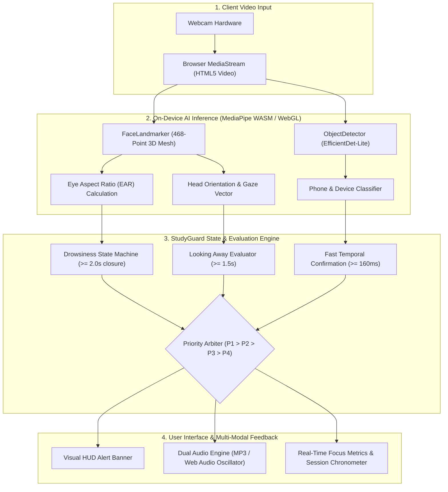

# 🧠 StudyGuard AI

> **Autonomous Private On-Device Study Intelligence**

[](https://study-guard-ai-topaz.vercel.app)
[](https://react.dev)
[](https://vitejs.dev)
[](https://developers.google.com/mediapipe)
[](https://study-guard-ai-topaz.vercel.app)
[](https://opensource.org/licenses/MIT)

---

## 📌 Introduction

**StudyGuard AI** is a privacy-first, browser-based computer vision study assistant engineered to help students, developers, and researchers maintain deep cognitive focus. 

Unlike conventional proctoring or focus-tracking solutions that transmit raw video feeds to remote cloud servers, StudyGuard AI executes state-of-the-art neural vision models **100% locally inside the user's browser sandbox** using Google MediaPipe, WebAssembly (WASM), and WebGL acceleration. 

The application operates completely on-device without requiring end users to run a local backend, install specialized drivers, or expose their personal study space to third-party cloud infrastructure.

---

## 🌐 Live Demo

Experience StudyGuard AI directly in your browser:

👉 **[Launch StudyGuard AI (Production App)](https://study-guard-ai-topaz.vercel.app)**  
*(Alternative Domain Alias: [study-guard-ai-vimleshyadav.vercel.app](https://study-guard-ai-vimleshyadav.vercel.app))*

> **No installation or account creation required.** Works out-of-the-box on modern desktop browsers (Chrome, Edge, Brave, Firefox).

---

## ✨ Key Features

### 🎯 Real-Time Study Focus Monitoring
Continuous facial presence verification and focus tracking. Distinguishes active study from study-space desertion with smart temporal smoothing to prevent false alarms during natural micro-movements.

### 📱 Electronic Device Detection
High-speed object recognition identifying smartphones and digital distractions. Features an optimized 130ms inference loop (~7.5 FPS) with normalized category resolution (`cell phone`, `phone`, `mobile phone`, `telephone`) and dual-hit temporal confirmation to rapidly flag phone usage.

### 👀 Eye and Gaze Monitoring
Tracks 3D head yaw and eye vector geometry using a 468-point facial mesh. Flags sustained looking-away behavior ($\ge 1.5\text{s}$) to prompt students back to their reading material or workspace.

### 😴 Drowsiness Detection
Calculates normalized Eye Aspect Ratio (EAR) across both eyes in real time. Accurately differentiates natural involuntary blinks from fatigue-induced microsleeps and prolonged eyelid closures ($\ge 2.0\text{s}$).

### 🚨 Unified Smart Alert System
Autonomous, prioritized alert resolution matrix (P1: Drowsiness $\rightarrow$ P2: Phone/Device $\rightarrow$ P3: Looking Away $\rightarrow$ P4: Attention Loss). Delivers color-coded HUD banners with instant dismiss and quick-mute capabilities.

### 🔊 Custom Alarm System
Integrated audio alarm engine with **5 distinct built-in alarm tunes** (Classic Chime, Focus Pulse, Digital Radar, Gentle Bells, Urgent Warning). Features live audio preview, volume attenuation, persistent `localStorage` saving, and a resilient Web Audio API synthetic fallback in case autoplay policies restrict media playback.

### ⏱️ Study Session Management
Drift-free Deep Work study timer with high-precision timestamp calculation. Allows students to start, pause, resume, reset, and log continuous focus blocks without clock drift across browser background tabs.

### 🔒 Privacy-First On-Device AI
Zero video stream uploads, zero cloud inference latency, and zero telemetry tracking. All computer vision tensors are calculated in volatile browser memory and immediately discarded.

---

## 🔒 Privacy-First Architecture

StudyGuard AI was engineered around strict user privacy principles:

* **100% Local Inference**: All neural networks run on the client side inside the browser via WebAssembly and WebGL execution pipelines.
* **Zero Video Streaming**: Webcam frames never leave your device. Video data is processed frame-by-frame in RAM and garbage-collected within milliseconds.
* **No Biometric Identity Recognition**: The system tracks abstract geometric facial landmarks (distance between eyelid coordinates and head orientation). It does not create facial profiles, identify individuals, or perform facial recognition.
* **Zero Persistent Video Storage**: No webcam frames, video clips, or photos are ever saved to disk, cookies, or cloud storage.
* **Local Preference Persistence**: User settings (volume, active alarm tune, alert toggles) are stored strictly on the user's computer via standard browser `localStorage`.

---

## 🏗️ System Architecture

The following diagram illustrates how the client-side pipeline captures video, runs computer vision tasks, resolves alert conditions, and delivers multi-modal interventions:



---

## 📸 Application Preview

Below are views of the StudyGuard AI workspace and user interface:

### 1. Main Dashboard & Workspace

*Central study command center with neural vision workspace, active telemetry, and session statistics.*

### 2. Camera & Vision Workspace

*Live computer vision monitoring displaying on-device facial landmark mesh, gaze vectors, and object detection overlays.*

### 3. Deep Work Study Session

*Drift-free chronometer interface for tracking deep study sprints with pause, resume, and milestone tracking.*

### 4. Smart Alert Controls & Alarm Settings

*Granular alert configuration panel with 5 selectable alarm tunes, audio preview, volume slider, and condition toggles.*

### 5. Study Intelligence & Privacy Suite

*Overview of on-device privacy protections, machine learning runtime status, and focus telemetry.*

> *Note: If screenshot assets are not displaying locally, ensure the relevant images are placed inside the `./screenshots/` directory.*

---

## 🛠️ Technology Stack

| Domain | Technology / Library | Description |
| :--- | :--- | :--- |
| **Frontend Framework** | **React 19** | Declarative component architecture for reactive state and UI |
| **Build & Tooling** | **Vite 8** | High-performance ES module bundler and dev server |
| **Styling & Design** | **Tailwind CSS v4 & Vanilla CSS3** | Cybernetic dark glassmorphic design system |
| **Computer Vision Engine** | **Google MediaPipe Vision Tasks** | `@mediapipe/tasks-vision` client-side WebAssembly runtime |
| **Landmark Detection** | **MediaPipe FaceLandmarker** | 468-point 3D facial mesh for EAR and head pose tracking |
| **Object Detection** | **EfficientDet-Lite0 (`.tflite`)** | Real-time on-device classification for mobile phones and electronics |
| **Audio Alert Engine** | **HTML5 Audio + Web Audio API** | Primary multi-tone MP3 alerts with procedural synthesizer fallback |
| **Client Storage** | **Browser `localStorage` API** | Local client persistence for sound, volume, and alert settings |
| **Deployment Platform** | **Vercel** | Global edge hosting with automated HTTPS and instant cache invalidation |

---

## 💻 Local Installation & Setup

Follow these steps to run StudyGuard AI locally on your development machine:

### Prerequisites
* [Node.js](https://nodejs.org/) (version 18.0 or higher)
* [npm](https://www.npmjs.com/) (version 9.0 or higher)
* A modern browser with webcam permissions enabled (Google Chrome, Microsoft Edge, Brave, or Mozilla Firefox)

### 1. Clone the Repository
```bash
git clone https://github.com/vimleshyadav2509/StudyGuard-AI.git
cd StudyGuard-AI
```

### 2. Install Dependencies
You can install dependencies from the repository root or within the frontend directory:

```bash
# Option A: From root directory
npm install

# Option B: Directly in frontend directory
cd frontend
npm install
```

### 3. Start the Development Server
```bash
# From root directory
npm run dev

# Or from frontend directory
cd frontend
npm run dev
```

The Vite development server will start instantly:
```text
  VITE v6.x.x  ready in 240 ms

  ➜  Local:   http://localhost:5173/
  ➜  Network: use --host to expose
```

Open `http://localhost:5173` in your browser and grant webcam permissions when prompted.

### 4. Build for Production
To generate an optimized, minified production build:

```bash
npm run build
```
The compiled assets will be output to `frontend/dist/`.

---

## 🚀 Production Deployment

StudyGuard AI is configured for frictionless deployment on **Vercel**:

1. Fork or push the repository to GitHub.
2. Log into [Vercel](https://vercel.com) and click **Add New Project**.
3. Import `StudyGuard-AI`.
4. The deployment configuration is automatically recognized via the root [`vercel.json`](./vercel.json):
   - **Framework Preset**: `Vite`
   - **Install Command**: `npm --prefix frontend install`
   - **Build Command**: `npm --prefix frontend run build`
   - **Output Directory**: `frontend/dist`
5. Click **Deploy**. Your app will be live within seconds with full HTTPS and WebAssembly support.

---

## 💡 Practical Use Cases

* **Self-Directed Study Sessions**: Maintain cognitive momentum while preparing for competitive exams, university coursework, or certifications.
* **Deep Work & Software Engineering**: Minimize involuntary context switching and phone checking during coding sprints.
* **Digital Distraction Management**: Immediate sensory feedback when reaching for a smartphone during study hours.
* **Drowsiness & Fatigue Prevention**: Alerts students when micro-sleeps or eye strain occur so they can step away for a healthy break.
* **Hackathons & Academic Demonstrations**: A state-of-the-art showcase of client-side WebAssembly computer vision without server costs.

---

## 🔮 Future Enhancements

* 📊 **Historical Focus Analytics**: Visual charts showing daily/weekly study retention and distraction breakdown.
* 🍅 **Adaptive Pomodoro Intervals**: Dynamic session duration adjustments based on detected fatigue frequency.
* 🧘 **Ergonomic Posture Alerts**: Detection of slumping, spinal curvature, or improper camera distance.
* 🎯 **Custom Threshold Calibration**: Personalized calibration wizard for users with unique eye shapes or ambient lighting conditions.
* ☁️ **Encrypted Cloud Sync (Optional)**: User-controlled, end-to-end encrypted session backup across multiple devices.

---

## 👨‍💻 Developer

**Vimlesh Kumar Yadav**  
*B.Tech in Computer Science & Engineering*  
*Project*: StudyGuard AI  
*GitHub*: [@vimleshyadav2509](https://github.com/vimleshyadav2509)

---

## ⭐ Support & Feedback

If you find StudyGuard AI useful or educational:
- **Star** this repository on [GitHub](https://github.com/vimleshyadav2509/StudyGuard-AI) to support ongoing development!
- Report bugs or submit feature suggestions via [GitHub Issues](https://github.com/vimleshyadav2509/StudyGuard-AI/issues).

---

<div align="center">

**Privacy First. Intelligence On-Device. Focus Without Distraction.**

</div>
